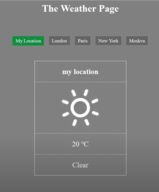

# weather-app

👋 Welcome to JS challenge!  
This challenge is to write JS code for a weather application.

## A Look at the App

Here's a glimpse for the app

For a more in-depth tour, check out these videos:

[Video 1](https://www.youtube.com/watch?v=2ZEsqVrI8mQ)

[Video 2](https://www.youtube.com/watch?v=R5Py7UVAc44)

## ToDo

[ ] - fetch weather data using API call and display in console.  
